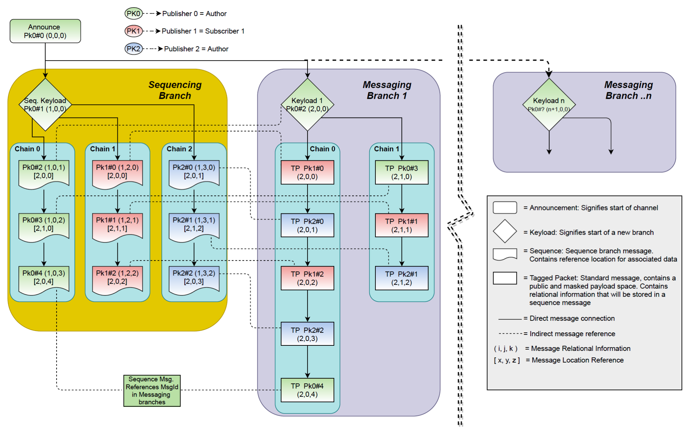

# Sequencing with branches

**As the owner of the channel, the author can choose to create their preferred branching configuration. This topic explains the differences and helps you chose the type that suits your needs**

Messages generated through the Channels protocol can be attached in a variety of customisable “tree” shapes. The customisable nature of these trees can make navigation and key management complicated quickly, especially in a multi publisher environment. 

Two model configurations exist that all channel shapes are derived from: “Single Branching” and “Multi Branching”. Branching refers to the delineation of publisher and listener management within a channel. 

Upon creation of a new channel, a flag indicating which of these two models is to be used must be specified to determine the sequencing model logic that all participants will be configured with after processing the `Announcement`. See [Creating a new channel](../guides/creating-a-new-channel.md).

| **Workflow** | **Advantages** | **Disadvantages** |
|:----|:-----|:----|:----|
|Single branching| A single linear branch makes reading and writing messages easy and logical | Multiple publishers in a channel will lead to overhead due to conficting "next" messages|
|Multi branching| Multiple branches allows a channel to have multiple publishers whilest maintaining a chronological order | Maintaining a sequence requires a second message send, and leads to a roundabout reading experience if not properly managed|

:::info:
If you never plan to have more than 1 publisher (The author) in your channel, multi branching has no advantage for you. 
:::

## Single branching

 In a single branch implementation, all participants post messages to a single branch in a sequential ordering. Each message in the branch will increase the sequence number for the next message regardless of which publisher sends it. 

## Multi branching

In a “Multi-Branch” channel, messages will be placed into a hierarchy of “branches” and “chains” within the message tree. Each branch can contain several chains, attaching to previously existing messages in a variety of orders and configurations. 

In order to organise these messages, a special sequencing branch is used. Once a new publisher has been established in the channel, the channel `Author` will inform the other participants of the existence of this new publisher, and a new “chain” of messages will be formed for that publisher from the channel sequencing branch. 

In order to navigate complex message graphs, each publisher publishes sequencing messages into their chain within the sequencing branch. These Sequence messages hold the information required to locate the actual message link from the message branch.

Channel participants keep a mapping of publisher identities and sequence states. Participants will search for these sequence messages iteratively to indicate the presence of a new message from a known  publisher, and fetch that referenced message. 
