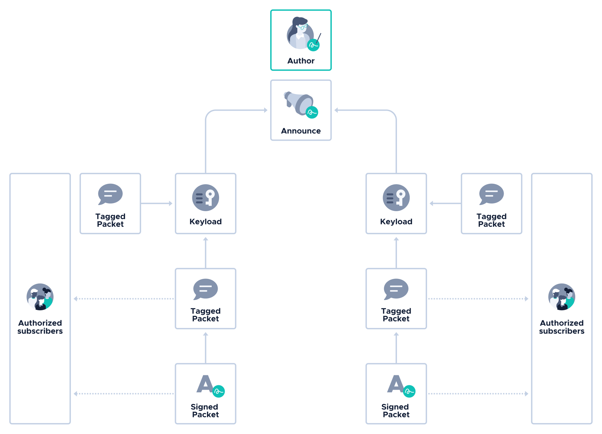

# Publishing encrypted data

**The author can publish encrypted data in masked payloads and authorize subscribers to decrypt that data and encrypt their own. This topic explains the process of publishing masked payloads for the author.**

The author can publish masked payloads in both `SignedPacket` and `TaggedPacket` messages.

The difference between these message types is that `TaggedPacket` messages are anonymous, whereas `SignedPacket` messages are authenticated by the author's signature. 

As the owner of the channel, the author can choose to [authorize subscribers](../guides/authorizing-subscribers.md) to decrypt masked payloads and to send their own anonymous ones in `TaggedPacket` messages.

To publish masked payloads, the author generates a session key, which is used to encrypt and decrypt them.

This session key is encrypted with the authorized subscribers' public encryption keys and published in a `Keyload` message for them to decrypt and use.

:::info:
Subscribers cannot publish masked payloads or decrypt the author's masked payloads without the author's permission (a valid session key).
:::

As a result, each `Keyload` message essentially acts as the start of a private channel within the main one, allowing you to create fine-grained permissions to content. 

