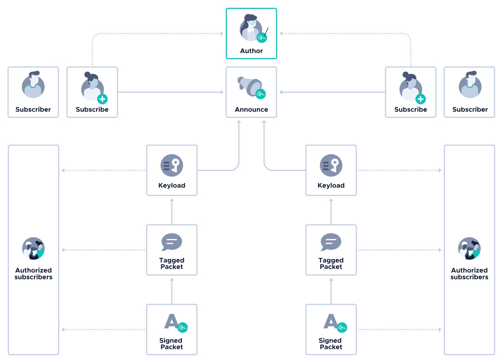

# Authorizing subscribers

**As the owner of the channel, the author can choose to authorize subscribers to decrypt masked payloads and to send their own anonymous ones in `TaggedPacket` messages. This topic explains the options an author has for managing authorized subscribers.**

Authorization is handled by `Keyload` messages, which contain session keys that are encrypted with the authorized subscribers' public encryption keys.

To get the public encryption keys of authorized subscribers, you can use one of the following workflows.

| **Workflow**    |**Advantages**|**Disadvantages**|
|:----|:-----|:----|:----|
|Managing subscribers on the channel|You can use the built-in `Subscribe` and `Unsubscribe` messages to authorize and deauthorize subscribers | You must set up a process for handling all `Subscribe` and `Unsubscribe` messages, some of which could be sent as spam by malicious subscribers|
|Managing subscribers outside of the channel|You can avoid the overhead of managing all `Subscribe` and `Unsubscribe` messages|If you want to authorize or deauthorize subscribers after announcing the channel, you must set up a process for doing so outside of the channel

:::info:
You must trust these subscribers because their keys are used to encrypt the session key. If the subscribers were malicious, they could share the session key with anyone and expose the masked payloads.
:::

## Managing authorized subscribers on the channel

If the author is created with an x25519 key pair, subscribers can publish  `Subscribe` messages on the channel to request access to a session key.

After publishing a `Subscribe` message, the subscriber sends the author the message identifier. The author then decides whether to publish a `Keyload` message for that subscriber.

:::info:
A single `Keyload` message may contain a session key for more than one subscriber.

You can use the `share_keyload_for_everyone()` method to generate a session key for all known subscribers.
:::

If the subscribers who published the `Subscribe` messages no longer plans on reading encrypted messages on the channel, they can notify the author by publishing `Unsubscribe` messages. By notifying the author of their intent to unsubscribe, subscribers reduce the amount of computation that the author must do to generate future session keys. It's in the author's interest to listen for these messages.

### Linking

Because the `Announce` message contains the author's public encryption key, `Subscribe` messages should always be linked to it.

`Unsubscribe` messages should always be linked to the corresponding `Subscribe` message because it contains the information that the author needs to verify the message.

See [Linking messages](../guides/linking-messages.md) for more information.

## Managing authorized subscribers outside of the channel

Instead of allowing subscribers to request access to a session key, you can choose authorized subscribers before announcing the channel. These subscribers may come from an external source such as a list of members' email addresses in a database.

To set up subscribers before announcing the channel, you can choose them in advance and either establish a pre-shared key or request their X25519 keys.

The author can then later use these keys to publish a `Keyload` message.

