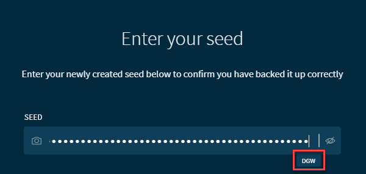

# Checksums

**A checksum is the name given to the [trytes](../the-tangle/ternary.md) that are appended to the end of an address or a seed. This topic discusses what checksums are for and what they look like.**

Checksums are often appended to addresses and seeds in user interfaces such as wallets to help you to detect typos.

Changing a single tryte in a seed or a checksum results in a completely different checksum.

This example is from the Trinity wallet. The highlighted trytes are the checksum.

## Checksum format

The length of a checksum depends on whether it's for an address or a seed. Address checksums are 9 trytes long, whereas seed checksums are 3 trytes long. The reason for this difference is that mistyping an address can lead to sending IOTA tokens to the wrong address, so the checksum must be more resistant to [collisions](https://en.wikipedia.org/wiki/Collision_(computer_science)).

||**Without checksum**|**With checksum**|
|:--|:---|:---|
|**Seed**|PUEOTSEITFEVEWCWBTSIZM9NKRGJEIMXTULBACGFRQK9IMGICLBKW9TTEVSDQMGWKBXPVCBMMCXWMNPDX|PUEOTSEITFEVEWCWBTSIZM9NKRGJEIMXTULBACGFRQK9IMGICLBKW9TTEVSDQMGWKBXPVCBMMCXWMNPDX**XTY**|
|**Address**|GWQQYWCUFLDR9LIWDITVHTPYYO9BAMOADFLNBIHYLIFDTORUCFCOGRQFK9IXEHVEMDVZH9RYOXAFIVUOA|GWQQYWCUFLDR9LIWDITVHTPYYO9BAMOADFLNBIHYLIFDTORUCFCOGRQFK9IXEHVEMDVZH9RYOXAFIVUOA**DAYDSMFZW**| 

:::info:
As a security precaution, some applications such as [Trinity](root://wallets/0.1/trinity/introduction/overview.md) allow you to enter only addresses that include a checksum.
:::

## Next steps

Test your new knowledge by creating your own IOTA account and [transferring some test IOTA tokens](../transfer-tokens/overview.md).
