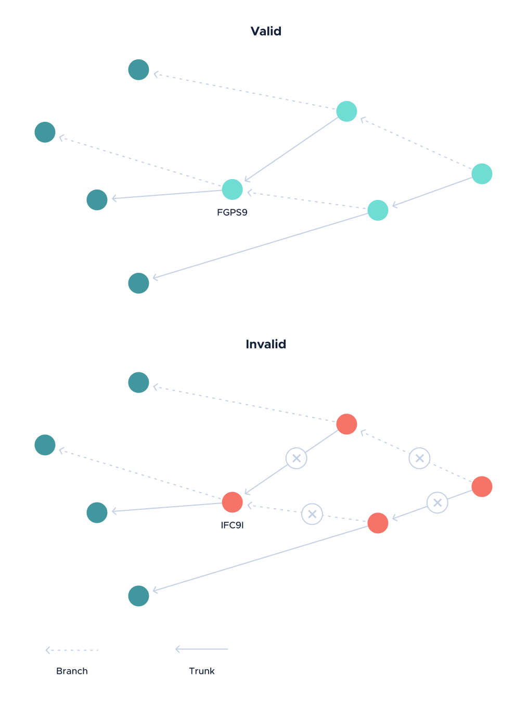

# Immutability in the Tangle

**This topic explains what makes transactions immutable when they are attached to the Tangle.**

One of the most fundamental properties of the Tangle is that it is immutable. After a transaction is attached to the Tangle, it cannot be changed.

This immutability is thanks to the unique properties of hashing algorithms.

## Understanding hashing algorithms

A hashing algorithm is a mathematical function that converts an input value of any length into another compressed value of a fixed length. Values returned by a hashing algorithm are called message digests or simply hashes.

In IOTA, the hashing algorithm that's used is called [Curl](../references/glossary.md#Curl), which takes [ternary](../the-tangle/ternary.md) input values called trits and always outputs a 243-trit hash.

For example, a Curl hash of "Hello world" is the same length as a hash of all the text in this topic.

Try changing the "Hello world" message to something else, and see how different the resulting hash is.

:::info:
This example converts the trits to trytes for better readability.
:::

<iframe height="400px" width="100%" src="https://repl.it/@jake91/hashing-example?lite=true" scrolling="no" frameborder="no" allowtransparency="true" allowfullscreen="true" sandbox="allow-forms allow-pointer-lock allow-popups allow-same-origin allow-scripts allow-modals"></iframe>

## Transaction hashes and references

In IOTA all the [fields of a transaction](../references/transaction-fields.md) are hashed to generate its transaction hash.

To make the Tangle immutable, each transaction in it is attached to two previous transactions by referencing their transaction hashes in the `branchTransaction` and `trunkTransaction` fields.

Therefore, a change to any transaction would also invalidate any transactions that are [directly or indirectly attached to it](../the-tangle/overview.md#references).

To keep this example image simple, only the first 5 trytes of the transaction hash are displayed.

:::info:
After doing [proof of work](../cryptography/proof-of-work.md), a transaction hash must end in a certain number of 0 trits.

Because three 0 trits is [encoded](../the-tangle/ternary.md) as the number 9, transaction hashes often end in 9s when they include a proof of work.
:::

## Bundle hashes

All transactions in the same [bundle](../the-tangle/transaction-types.md#bundles) also have the same bundle hash in their `bundle` field to tie them all together.

This hash is a Curl hash of the **bundle essence**, which includes the following transaction fields:

- `address`
- `value`
- `obsoleteTag`
- `currentIndex`
- `lastIndex`
- `timestamp`

As a result, if any values of the bundle essence were to change, the bundle hash would change, invalidating all transactions in the bundle.

:::info:
You could change any other transaction fields in a bundle and keep the same bundle hash. As a result, only a tail transaction hash should be used to look up a unique transaction.
:::

## Next steps

Find out what [type of data you should store in the Tangle](../the-tangle/storing-data.md).

For an example of changing a transaction's fields and keeping the same bundle hash, see [Change the messages in a bundle](root://core/1.0/tutorials/js/change-message-in-bundle.md).