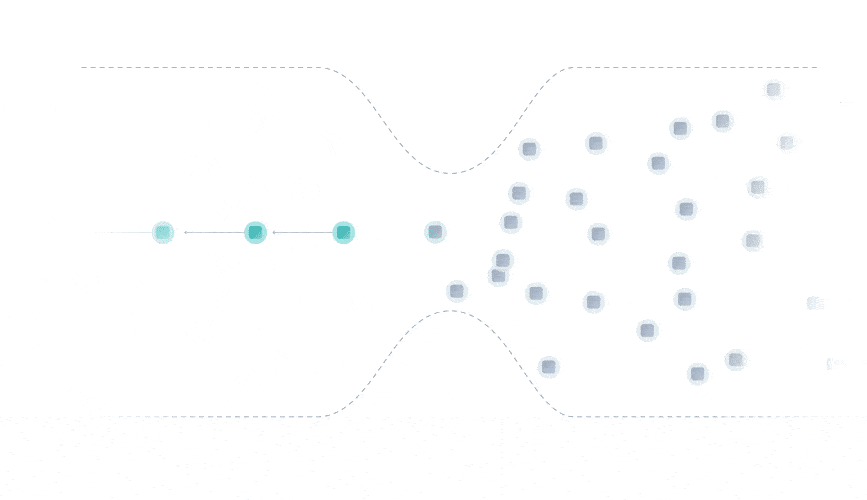
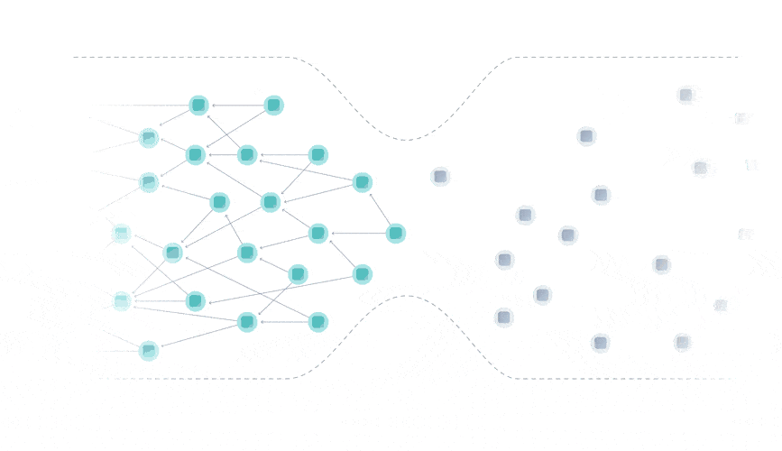

# Differences between the Tangle and blockchain

**This topic describes some of the main differences between the Tangle and a blockchain.**

Blockchains and the Tangle both fall under the same category of distributed ledger technology (DLT).

The two main differences between blockchains and the Tangle are the following:

- The Tangle has no transaction fees
- IOTA networks have no miners

To explain these points, you need to understand the differences between the data structures and the consensus mechanisms in these DLTs.

## The blockchain data structure

The blockchain data structure consists of a chain of sequential blocks, where each block contains a limited number of transactions.

As a result, you can attach new transactions to only one place: A block at the end of the chain. Due to this limitation, blockchain networks often experience slow confirmation times. This limitation is known as the _blockchain bottleneck_.

## The Tangle data structure

The Tangle data structure is a directed acyclic graph (DAG), where each transaction is attached to two previous ones.

Rather than being limited to a single place for attaching new transactions, you can attach transactions anywhere in the Tangle, which removes the limit on confirmation times.

## Consensus in a blockchain

In blockchains, the network is split into miners and users. Miners consume large amounts of computing power to complete the proof of work (PoW) required to chain the blocks together.

Miners are incentivized to validate transactions and do proof of work because of the following:
- The fees that users are willing to pay to have their transactions included in a block
- The reward that the network gives them for mining the block before other miners

The only way to reverse transactions in a blockchain is to mine a new blockchain in the time it takes other miners to mine a single block. To do so, a miner would need 51% of the network's ability to do PoW known as hash power.

As a result, requiring PoW secures blockchain networks by making it difficult to attack, change, or stop. The more miners that mine, the more the secure the network.

## Consensus in the Tangle

In the Tangle, transactions require no fees because the network has no miners.

In the Tangle, PoW is not used to secure the network. Instead, proof of work is used only to discourage spam transactions.

To reach a consensus, all IOTA nodes validate transactions and use [the Coordinator](../the-tangle/the-coordinator.md) to decide which ones are confirmed. The Coordinator helps to secure the network by making sure that only valid transactions are confirmed.

:::info:
The Coordinator is temporary. The IOTA Foundation is working on a project to remove the Coordinator and from the network: [Coordicide](https://coordicide.iota.org/post-coordinator).
:::

## Next steps

[Discover what data is actually stored in the Tangle](../the-tangle/ternary.md).