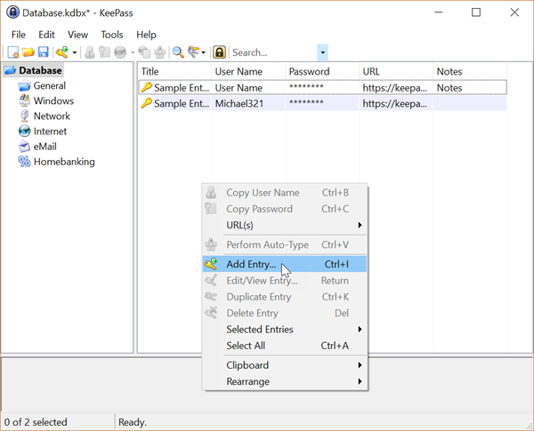

# Create a seed

**In this tutorial, you create a seed and back it up so you can use as your IOTA account.**

Seeds are the master key to your public keys, addresses, and their private keys. Anyone with your seed can withdraw IOTA tokens from your addresses or impersonate you by signing messages with your private keys.

Therefore, the most important attribute to consider when creating a new seed is randomness. The more random your seed, the more secure it is.

:::info:
The total number of possible seeds is almost unlimited (8.7 x 10<sup>115</sup>). As a result, the chances of two seeds being the same is very unlikely.
:::

In this tutorial, you do the following:

- Generate a random seed
- Back up your seed

## Step 1. Generate a random seed

You can generate a random seed in many ways. For example, rolling a dice and translating the numbers into trytes.

For this tutorial, you have the following options:

- Use the command line
- Use the KeePass password manager

:::info:
You can also create a seed directly in the Trinity wallet. See [Create an account](root://wallets/0.1/trinity/how-to-guides/create-an-account.md) in the Trinity documentation.
:::

### Use the command line

Command-line interfaces, such as PowerShell in Windows, the Linux Terminal or Terminal for macOS, offer tools for generating random characters for seeds.

--------------------
### Linux

```bash
cat /dev/urandom |tr -dc A-Z9|head -c${1:-81}
```
---
### macOS

```bash
cat /dev/urandom |LC_ALL=C tr -dc 'A-Z9' | fold -w 81 | head -n 1
```
---
### Windows Powershell

```bash
$b=[byte[]] (1..81);(new-object Security.Cryptography.RNGCryptoServiceProvider).GetBytes($b);-join($b|%{[char[]] (65..90+57..57)[$_%27]})
```
--------------------

### Use KeePass

KeePass is a password manager that stores passwords in encrypted databases, which can be unlocked with one master password or key file.

These steps are for Windows, but you can also use KeePass on Linux or macOS.

1. [Download the KeePass installer](https://keepass.info/)

2. Open the installer and follow the on-screen instructions

3. Open KeePass and click **New**

    

4. After you've followed the instructions and saved the KeePass file on your computer, right click the empty space and click **Add entry**

    

5. Click **Generate a password**

    

6. Select only the following options and click **OK**:

- Length of generated password: 81
- Upper-case (A, B, C, ...)
- Also include the following characters: 9
    
7\. Click **OK** to save your seed

## Step 2. Back up your seed

You can back up or store your seed in many ways, such as on paper or in a file. But, no storage option is 100% safe, so you should consider the risks and mitigate them as much as possible.

### What should you do?

This list offers you some advice for storing your seed:

- Make sure that the physical location in which you store your seed is protected from fires, floods, theft, and other physical risks.

- Keep a copy of your seed in a bank vault or safe deposit box

- Use a password manager (such as KeePass) or virtual vault that is protected by a passphrase and/or a key file

- Use an encrypted disk or NAS to store your seed or password database

### What should you not do?

This list offers you some ways to avoid losing your seed:

- Do not print your seed with a public printer

- Do not leave your seed on unprotected devices such as USB drives or external hard disks

- Do not store your seed on a public cloud service

- Do not share your seed with anyone

## Next steps

[Generate two addresses](../transfer-tokens/generate-an-address.md) that you can use to transfer IOTA tokens.
