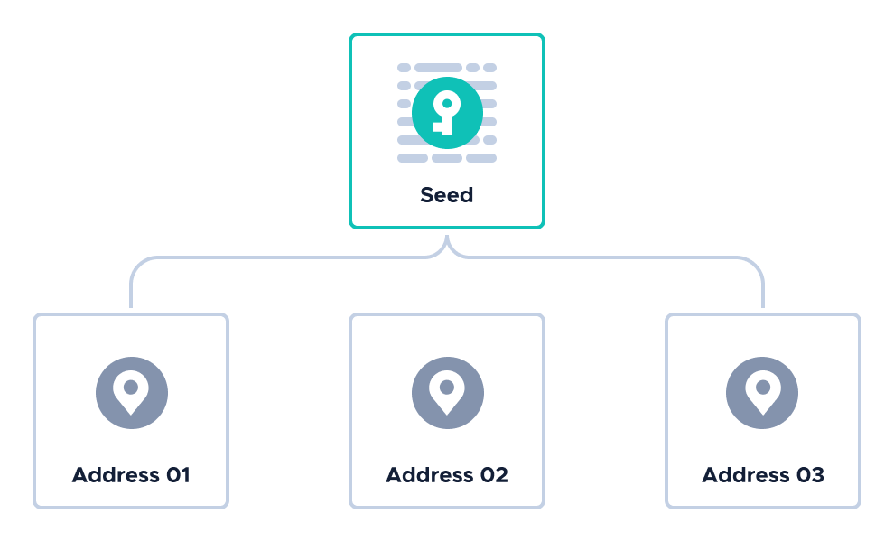

# Addresses

**An address is like a personal account that belongs to a [seed](../accounts/seeds.md) and that can have a balance of [IOTA tokens](../the-tangle/genesis.md). This topic explains what addresses are, how many of them you can have, and how to use them.**



Addresses are the public half of a [public/private key pair](https://en.wikipedia.org/wiki/Public-key_cryptography), which belongs to a seed. As a result, each address has a corresponding private key which is used to prove to nodes who owns it.

Using a seed, you can generate an [almost unlimited number of addresses and private keys](#maximum-number-of-addresses). 

You can prove that you own an address by doing the following:

- Using the private key to sign a transaction
- Adding the resulting signature fragments to the `signatureMessageFragment` fields of transactions

:::info:
It's safe to share addresses with anyone because only the seed owner knows the private key to prove ownership of them.
:::

## Address type

In the past, IOTA used two address types but, within and beyond Chrysalis, it supports one: Ed25519, and thus reusable addresses.

Ed25519 is a modern EdDSA signature scheme using [SHA-512](https://en.wikipedia.org/wiki/SHA-512) and [Curve25519](https://en.wikipedia.org/wiki/Curve25519). It addresses the disadvantage of statefulness, size, and speed found in previous schemes. And at its core, Ed25519 support allows for smaller transaction sizes and to safely spend funds which were sent to an already used deposit address. 

## Address formats

An address is a unique string of 81 [trytes](../the-tangle/ternary.md) (or 90 trytes with a [checksum](../accounts/checksums.md)).

```
OGMMQJUDMNNYSOAXMJWAMNAJPHWMGVAY9UWBXRGTXXVEDIEWSNYRNDQY99NDJQB9QQBPCRRNFAIUPGPLZ
```

To support Ed22519 and legacy W-OTS, IOTA also uses Bech32, an extendable address format..

The human-readable encoding of the address is Bech32 (as described in [BIP-0173](https://github.com/bitcoin/bips/blob/master/bip-0173.mediawiki)). A Bech32 string is at most 90 characters long and consists of:

- The human-readable part (HRP), which conveys the IOTA protocol and distinguishes between Mainnet (the IOTA token) and Testnet (testing version):
  - iot is the human-readable part for Mainnet addresses
  - tio is the human-readable part for Testnet addresses

- The separator, which is always 1
- The data part, which consists of the Base32 encoded serialized address and the 6-character checksum

## Maximum number of addresses

A seed can have an almost unlimited number of addresses (9<sup>57</sup>), which each have a unique index and a [security level](../transfer-tokens/generate-an-address.md):

* **Index:** Number between 0 and 9,007,199,254,740,991
* **Security level:** Number between 1 and 3

The same seed, index, and security level, will always result in the same address.

Likewise, the same seed with a different index and/or a different security level will result in a different address.

For example, when you generate addresses for index 0 and index 1 of all security levels, they are all unique:

|**Index**|**Security level**|**Address**|
|:-----|:-----|:-----|
|0|1|OGMMQJUDMNNYSOAXMJWAMNAJPHWMGVAY9UWBXRGTXXVEDIEWSNYRNDQY99NDJQB9QQBPCRRNFAIUPGPLZ|
|0|2 |BYNZSDZTNJOUMWLILVKUIWAFTCWTNYCDEI9ZNSRSAMLKURUWYANEGLVHUKWMZQCAMBTDSXKEFVOUYLDSW|
|0|3|CACHUSACNWAFFIGUAXVBUMZNSAGFPCFXVMYOBQ9IMD9ELZMOYOJAHWPFMOTRJMPISXIF9JEKNDZMQMZEY|
|1|1|CAZURLTWLREHEPODAQGFEKCVFJMUB9BFGBVWBGRSCWSKYD9UJIARRTPZJH9VUGQIQNJRBKIOATOJCSYJY|
|1|2|XIUPEDJXBADNCMWAZEGY9HPEASAMLFMIAAXIMLHVRDSADOORPPBFAQDCXGGZQQZLKCERW9J9CKVLASMTZ|
|1|3|FLXGZSXUJJLQFYYPTKYJRLWOCQSEXTTKVQMGOFPPYYZCLTAIEPKFXDNHHFGNJOASALAD9MJHNCCX9OUVZ|

## Utilities

You can use the following IOTA Tangle Utilities with addresses:

- [Convert an address into a QR code](https://utils.iota.org/qr-create)

- [Read an address from a QR code](https://utils.iota.org/qr-scan)

- [Search for transactions that include an address](https://utils.iota.org/)

## Next steps

Learn about [signatures](../accounts/signatures.md) and how they prove to nodes that you own an address.


