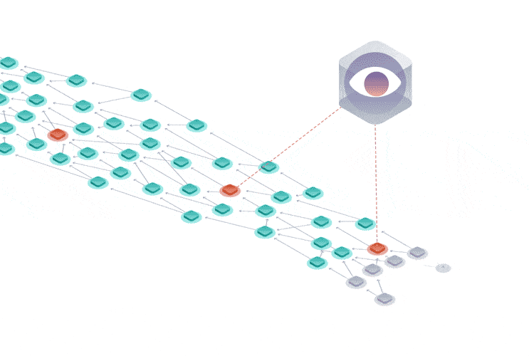
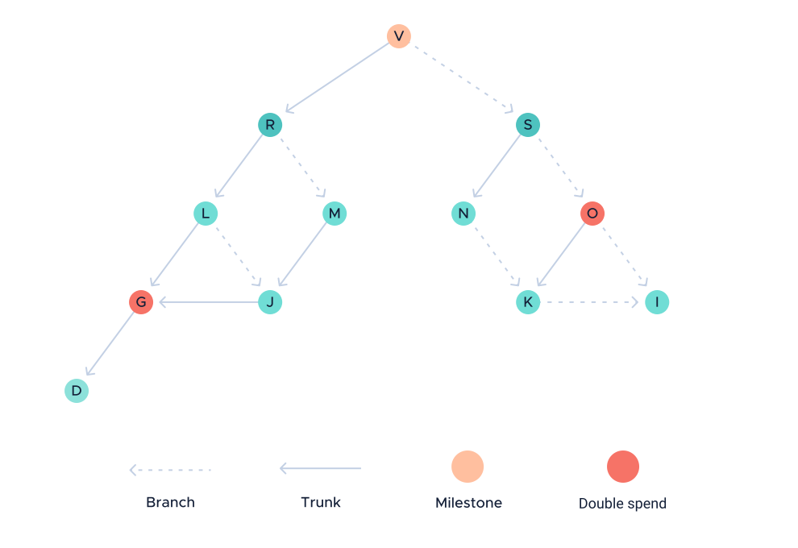

# The Coordinator

**The Coordinator is a client that sends signed messages called milestones that nodes trust and use to confirm messages. This topic describes how nodes use milestones to determine which messages are confirmed.**

:::info:
The Coordinator is temporary. The IOTA Foundation is working on a project to remove the Coordinator and from the network: [Coordicide](https://coordicide.iota.org/post-coordinator). Below is how the Coordinator was employed within IOTA.
:::

Messages in the Tangle are considered for confirmation only when they are directly or indirectly referenced by a milestone that has been validated by nodes.

To allow them to recognize milestones, all nodes in the same IOTA network are configured with the [Merkle root address](../accounts/addresses.md) of a Coordinator that they trust to confirm messages. Using this address, nodes can validate the signatures in milestones to verify whether they are signed by their trusted Coordinator.

To make sure that new messages always have a chance of being confirmed, the Coordinator sends indexed milestones at regular intervals. This way, nodes can compare the indexes of their milestones to check whether they are synchonized with the rest of the network.



##  Sending milestones

When the Coordinator sends a milestone, it does so in the same way as any [other messages](../first-steps/sending-transactions.md), except for the following difference:

- The [past cone](../references/glossary.md#past-cone) of the milestone's tip messages are considered for confirmation

This past cone includes all the pending messages that the tip transactions directly or indirectly reference. As a result, the name of this past cone is called the _confirmation cone_.

The confirmation cone of a milestone can contain two types of messages:

- **State-mutating:** Value messages that change the balances of two or more addresses
- **Non-state-mutating:** Zero-value messages and value transactions that withdraw IOTA tokens from an address and deposit them straight back

Non-state-mutating messages are always confirmed if they are referenced by a milestone.

However, state-mutating messages can lead to [double spends](../references/glossary.md#double-spend). Therefore, nodes and the Coordinator agree on which of the messages should be confirmed by ordering the confirmation cone.

### Ordering the confirmation cone

If the confirmation cone leads to a double spend, nodes and the Coordinator agree that the first messages that tries to transfer the IOTA tokens should be confirmed and the others should be ignored.

However, there are many ways to order messages in the Tangle. Therefore, nodes and the Coordinator agree to order the confirmation cone, using the following [depth-first search](https://en.wikipedia.org/wiki/Depth-first_search) that favors a path down the trunk message:

- Start from the milestone
- Follow the trunk messages through the confirmation cone until the first confirmed message is found
- Add the closest message to the list
- Backtrack through the other messages in the confirmation cone, following the same strategy that favors the trunk message first

For example, here are 26 messages labeled from A to Z.


Messages A, B, C, E, and F are confirmed by milestone H. The other messages are the confirmation cone of milestone V, and transactions G and O represent double spends.

To order the confirmation cone, you follow the trunk all the way down to message D. This is the first message in the confirmation cone. Then, you work your way back up, finding the rest of the messages until you have the final order.

So, starting from V, the messages are ordered like so:

- D
- G
- J
- L
- M
- R
- I
- K
- N
- O
- S
- V

As a result, milestone V confirms message G because it comes before messages O.

### Recording the confirmed messages

To allow nodes to check which messages in the confirmation cone are confirmed by a milestone, it includes the Merkle root of the tail messages that it confirmed.

To create the Merkle root, the Coordinator does the following:

- Use the message hashes of all the chosen tail messages as leaves

- Convert each message hash to 49-byte strings

- Calculate the 64-byte Merkle root

- Convert the Merkle root to 384 trits

### Constructing the bundle

After creating a Merkle root, the Coordinator is ready to add all of this information to its milestone bundle to allow nodes to validate it.

First, the Coordinator signs the bundle hash and adds the signature to the head messages.

The length of the signature depends on the depth of the Coordinator's Merkle tree:

```
Signature length in trytes = depth x 81
```

Then, the Coordinator appends the Merkle root to the signature.

To prove its ownership of the Merkle root, the Coordinator then signs it and adds that signature to the other zero-value transactions in the milestone bundle.

## Validating milestones

To validate milestones, nodes must do the following:

- [Validate the signatures](../cryptography/merkle-tree-address.md) to make sure that the Coordinator sent the milestone
- Validate the Merkle root to make sure that the Coordinator does not confirm double spends

To validate the Merkle root, nodes follow the same depth-first search as the Coordinator.

By doing so, nodes can create their own Merkle root and compare it against the one in the milestone. If both Merkle roots match, the milestone is valid. If not, the node rejects the milestone as invalid.

## Next steps

[Learn about tip selection](../the-tangle/tip-selection.md).