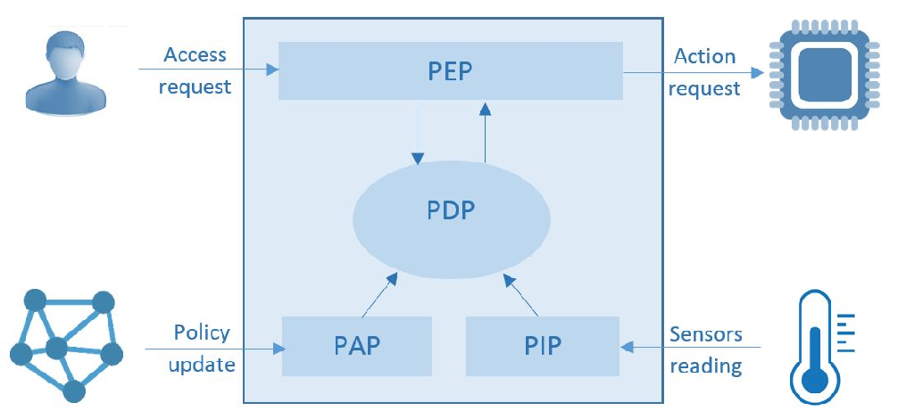
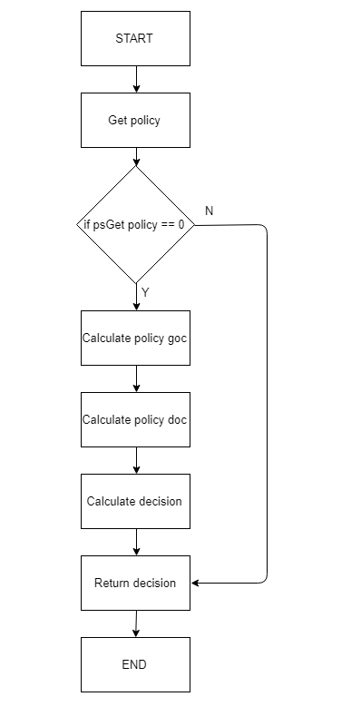
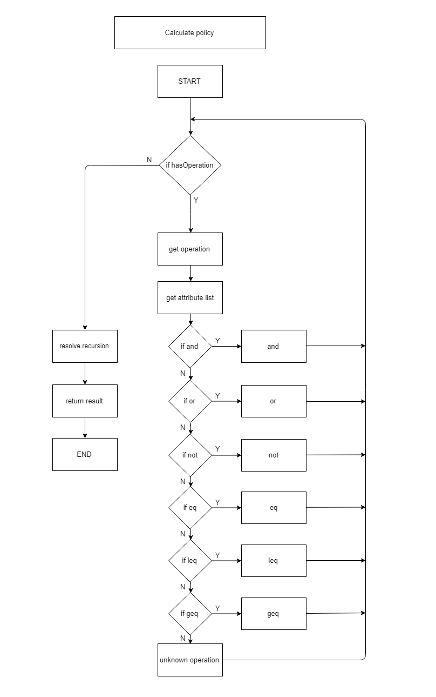

# Core concepts

**This article explores how Access works. If you're new to Access, this is a great place to learn about the architecture and other core concepts before getting started.**

**IOTA Access** is a lightweight access-control framework tailored for resource-constrained settings, such as embedded devices and the infrastructure in which they are used.

## Purpose

Existing access and permissions solutions rely on connections to a centralized system where the permissions and privilege structures are stored on a server and managed by a centralized entity. To check these access permissions, the device granting access needs to have a maintained connection and must often be stationary, leading to a highly restricted process.

In automotive and smart mobility contexts, none of this works reliably. Vehicles do not have a consistent connection all the time. Constantly checking in with a centralized structure requires high use of bandwidth and presents single points of failure along the data pipeline.

Access is about giving resource owners the freedom to grant or deny users' requests for access in a decentralized way.

Users may be human or machine, and resources may be anything that can be accessed by an electronic signal.

A great example of a resource is a vehicle because it consists of many accessible electronic components such as:

- A door lock
- An engine start button
- Dashboard data

A human may request access to drive the vehicle, while a machine may request access to read the data from the dashboard.

## Use Cases

These are some example use cases for IOTA Access.

### Rental

Alice owns a device that she wants to rent to Bob for IOTA tokens. Bob will be able to use this device after transferring tokens to the device's (or Alice's) wallet.

Alice uses Access to create the policy that gives Bob access to her device. Alice stores the policy on an IOTA Permanode.

:::info:
The current version of Access has a Policy Store, which acts as an intermediary database between the server, client and the Tangle. The long term vision for the project is based on a permanode solution.
:::

Bob then uses Access to request access to the device, and his requests are stored on the Tangle.

### Parental controls

Alice is Carol's mother. Carol wants to drive Alice's car. Alice writes a policy where she allows Carol to drive her car only under specific conditions (such as time, insurance, and GPS location).

Carol's ability to access the car is dictated by the policy. Alice synchronizes her policy with the vehicle, and Carol uses Access to request access to it.

### Entry restrictions

Alice owns a company in a building with smart locks. Alice writes a policy where her employees are allowed to enter the building only under specific conditions (such as time, employee ID, clearance level).

Employees' ability to access the building is dictated by the policy.

## Policies

A resource owner grants or denies access to users by defining their access rights in policies.

Policies contain rules that define which actions a user may access. For example, a father may write a rule that allows his daughter to drive the family car only between the hours of 9am and 8pm and only if she is insured.

This rule would consists of the following attributes:

- `action: d` (d for drive)
- `time: request.time`
- `insured: daughter.insuranceStatus`

Attributes can be either static or dynamic. Static attributes do not change, whereas dynamic ones need to be resolved at the time of the access request.

The daughter's insurance status is an example of a dynamic attribute because the status may change, depending on the time of the access.

The `action` attribute in a policy would be mapped to an internal function inside the resource. For example, the `turnOnEngine` action may map to the engine start button.

Policies are written according to the [policy specification](references/policy-specs.md).

## Architecture

The conceptual relationship between different Access components can be divided into 4 stacked layers:

- Application Layer
- Session Layer
- API Layer
- Portability Layer

The **Portability Layer** implements platform-dependent code. Anything related to drivers, Operating Systems and base libraries.

The **API Layer** implements platform-agnostic code. It's where Access Core, Access Secure Network, and IOTA functionality are implemented.

The **Context Layer** is where different functionality gets implemented as Context abstractions. It's where API calls are put together into cohesive blocks of specific functionality.

The **Application Layer** is where the Supervisor works as the main orchestrator that makes all Contexts interact with each other. Runtime Configurations are set in place, threads are initiated, and Contexts are set up.

Together, the Portability and API Layers form the **Access Core Software Development Kit**.

Together, the Context and Application Layers form the **Access Server Reference Implementation**.

## Access Core Software Development Kit

The Access Core Software Development Kit allows developers to build their own Access applications that interact with an Access server.

### Access Core API

The Access Core API is divided into 4 different modules (and a few submodules):
- Policy Administration Point (PAP)
- Policy Information Point (PIP)
- Policy Enforcement Point (PEP)
- Policy Decision Point (PDP)

#### Policy Administration Point

**PAP** is used for managing updates to policies and determining which policies apply to what requests. The API expects callback functions to be registered as [PAP plugins](references/plugin-specs.md).

#### Policy Enforcement Point

**PEP** routes the access request to the PDP for decision making, and acts on the received decision as appropriate within the system context. The API expects callback functions to be registered as **[PEP plugins](references/plugin-specs.md)**.

#### Policy Information Point

**PIP** coordinates the determination of attribute values used by the PDP. Attribute values are collected from the outside world, such as IOTA transactions, sensor data, or network traffic. The API expects callback functions to be registered as **[PIP plugins](references/plugin-specs.md)**.

#### Policy Decision Point

**PDP** is responsible for calculating the output for access requests. The API only consumed internally by other Core API modules.

On action request, the PEP requests a decision from the PDP, providing a `policyID` from the request. Based on the requested `policyID`, the PDP  requests the policy from the policy store and, if the response is a valid policy, it calculates a decision `true` or `false`, and then combines those results into a decision, which can be one of four defined values: `grant`, `deny`, `conflict` or `undef`, and returns this result to PEP.

:::info:
`GoC` stands for `Grant OR Conflict`, while `DoC` stands for `Denial OR Conflict`. This comes from the logical foundation behind the [Policy Language](/references/policy-specs.md).
:::

The calculation of `policy GoC` and `policy DoC` are modules that recursively solve every operation in the policy and return a result at the end. The module is executed recursively as long as the attributes in the attribute list contain predefined operations.

