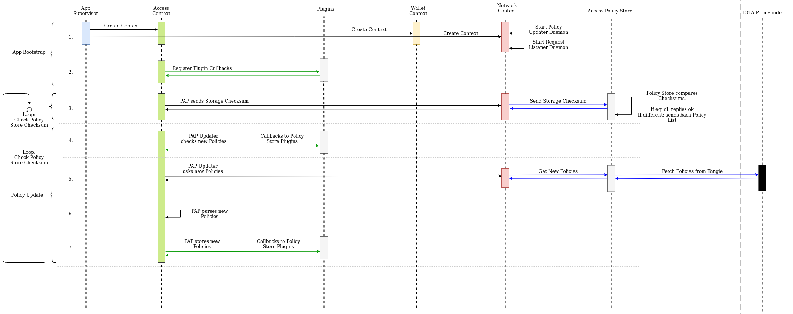

# Policy Update Protocol

**The Policy Update Protocol describes how users can communicate with the Access Core API to update policies for a given resource.**

:::info:
The protocol described in this section was inherited by the Legacy Design of early FROST implementations. Eventually this centralized entity will be completely removed and policy updates will be done via interactions between Access Actor and Wallet Actor, where the Wallet Actor communicates with an IOTA Permanode.
:::

1. The Supervisor creates Access, Wallet and Network Actors
2. The Network Actor starts the Policy Update and Request Listener Daemons
3. Access Actor registers Platform plugin callbacks
4. The Policy Administration Point (PAP) sends a Storage Checksum to the Network Actor, who forwards it to the Tangle Policy Store (TPS). If the ID sent by PAP matches the Checksum of policy stored on the TPS, then the TPS replies ok (nothing to update). If the ID differs, the TPS replies with a policy list (update required).
5. The PAP Updater compares the received policy list with all policies stored locally via the PAP plugin.
6. The PAP initiates the request for the policies that differ. Request is relayed to Network Actor, who forwards it to TPS. TPS fetches policy from IOTA Permanode and replies back.
7. PAP parses and [validates the new policies](#policy-validation) it receives.
8. PAP stores new policies via PAP plugin. PAP goes back to Checksum poll mode.

## Policy validation

Policy Validation is the process where Policy structure is checked in order to:

- Validate JSON
- Eliminate reduncancy of a binary circuit
- Limit values checks
- Check for suspicious conditions
